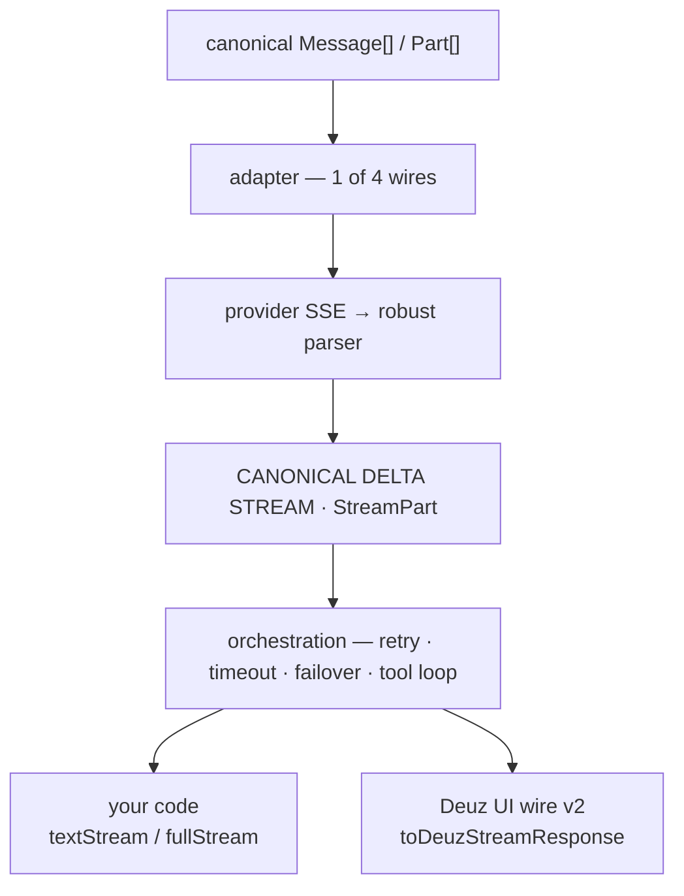

<div align="center">

<picture>
  <source media="(prefers-color-scheme: dark)" srcset="https://raw.githubusercontent.com/Deuz-AI/Deuz-SDK/main/assets/banner-dark.svg?v=1.7.0">
  
</picture>

<br>

[](https://www.npmjs.com/package/@deuz-sdk/core)
[](./packages/core/package.json)
[](https://github.com/Deuz-AI/Deuz-SDK/actions/workflows/ci.yml)
[](./packages/core/test/surface.test-d.ts)
[](./LICENSE)

**[Docs](./docs)** &nbsp;·&nbsp; **[The honest benchmark](#the-honest-benchmark)** &nbsp;·&nbsp; **[The unbreakable chatbot](#the-unbreakable-chatbot)** &nbsp;·&nbsp; **[Comparison](#how-it-compares)** &nbsp;·&nbsp; **[Architecture](#architecture--the-canonical-line)** &nbsp;·&nbsp; **[Changelog](./packages/core/CHANGELOG.md)**

</div>

```ts
import { streamChat } from '@deuz-sdk/core';
import { createAnthropic } from '@deuz-sdk/core/anthropic';
// or: createOpenAI, createGoogle, createXai, createVertexAnthropic — same call

const anthropic = createAnthropic({ apiKey: process.env.ANTHROPIC_API_KEY });

// Returns synchronously and never throws — failures arrive as typed parts.
const res = streamChat({
  model: anthropic('claude-opus-4-8'),
  messages: [{ role: 'user', content: 'Hello!' }],
});

for await (const chunk of res.textStream) process.stdout.write(chunk);
const usage = await res.usage; // { inputTokens, outputTokens, … } — USD rides the `cost` part (with a priceProvider)
```

`@deuz-sdk/core` is a from-scratch, independent AI SDK: chat, agentic tool loops, sub-agents, durable sessions, structured output, embeddings, memory, RAG, skills, MCP, image generation, local-first observability — and, since 1.7, everything a production chatbot needs: **persistence, cross-session memory, live USD cost, budget guardrails, signed approvals, resumable streams and cross-provider failover**. One package, **zero runtime dependencies**. The core is pure by construction and _enforced by lint_: no `Date.now()`, no `Math.random()`, no `process.env`, no `console` anywhere in `src/` — everything stateful is injected through one `Dependencies` seam, so the same code runs unchanged on Node, Deno, Bun and edge runtimes, and every test is a deterministic replay.

## Install

```sh
npm install @deuz-sdk/core        # the engine — whole dependency tree, one line
npm install @deuz-sdk/react       # optional: useChat v2 + headless components
```

> [!NOTE]
> Node ≥ 22 (or any edge runtime with `fetch`). Optional peers load only if you use them: `zod` (or any Standard Schema library) for typed objects and streaming data-part validation, `@modelcontextprotocol/sdk` for MCP, `react` for hooks, `unpdf`/`mammoth`/`xlsx` for document parsing.

> [!TIP]
> Using Claude Code, Cursor or another coding agent? Install the [Deuz skill](./skills/deuz-sdk) — it teaches the agent the SDK's real call patterns, edge-safety rules and exports:
>
> ```sh
> npx skills add Deuz-AI/Deuz-SDK
> ```

## The honest benchmark

Most SDK readmes open with a benchmark they win. This one opens with the one we don't.

<picture>
  <source media="(prefers-color-scheme: dark)" srcset="https://raw.githubusercontent.com/Deuz-AI/Deuz-SDK/main/assets/benchmark-dark.png?v=1.7.0">
  
</picture>

**69.6 / 100 — 14th of 16, scored by us, with the same rubric as everyone else.** 16 SDKs × 5 scenarios (chatbot, CLI, coding agent, ASI, AGI) × 6 weighted criteria (features 25% · DX 20% · performance 15% · community 15% · flexibility 15% · price 10%). The community criterion is log-scale and merciless: at 336 npm downloads/week and 2 stars, Deuz takes a flat 22 in every scenario — no mercy, on purpose. And every cell is re-derivable: the rubric, the per-criterion breakdowns, the live community numbers and the sources are all published in [`bench/`](./bench).

The honest read of the chart: **the gap to the top is community and breadth, not architecture.** The scenario 1.7 targeted — chatbot — already ties for 5th (76, with LlamaIndex). The score moved 67.6 → 69.6 while the rank went 13/15 → 14/16 only because Mastra entered the panel at 73.0. The CLI column (68) is what 1.8 is for.

## Six things even the Vercel AI SDK doesn't have

The benchmark dings us on community and breadth. It doesn't measure what the architecture buys — six capabilities that live **inside this library**, each verified against AI SDK 7's official docs and issue tracker (2026-07); the links are the receipts. No gateway, no hosted runtime, no Redis requirement.

| # | Deuz 1.7 | Where Vercel stands |
|---|---|---|
| 1 | **Built-in cross-session memory** — `memory: { seams, scope }` on any call: recall before the first token, mem0-style extract→reconcile after the turn, without blocking the response | No built-in; docs point to Mem0/Letta or "build your own" ([docs](https://ai-sdk.dev/docs/agents/memory); `@ai-sdk/memory` [does not exist](https://registry.npmjs.org/@ai-sdk/memory)) |
| 2 | **Live USD cost on the wire** — a cumulative `cost` stream part per step from a verified in-library price catalog, with prompt-cache savings as its own field | Closed **wontfix** ([vercel/ai#3932](https://github.com/vercel/ai/issues/3932)); USD only in the hosted AI Gateway |
| 3 | **Conversation budget guardrail** — `budget: { usd, tokens }` hard-stops the loop with a typed `budget-exceeded` part | No built-in budget stop; docs show hand-rolling a custom condition with hardcoded prices ([loop control](https://ai-sdk.dev/docs/agents/loop-control)) |
| 4 | **Cryptographic approval trail in chat** — HMAC-signed, runId-bound, expiring approval tokens flow through the UI wire and are verified on resume | `experimental_toolApprovalSecret` is [incompatible with WorkflowAgent](https://ai-sdk.dev/docs/agents/tool-approvals#signing-approvals-with-experimental_toolapprovalsecret) |
| 5 | **Durable × resumable, vendor-free** — F5 mid-tool-loop: the run continues from its checkpoint AND the stream reconnects gaplessly, over two 2-method seams you back with anything | Durable = hosted Vercel Workflow runtime; resume = Redis (`resumable-stream`) ([resume docs](https://ai-sdk.dev/docs/ai-sdk-ui/chatbot-resume-streams)) |
| 6 | **Mid-conversation cross-provider failover** — `fallbackModels` hops Anthropic→OpenAI→Gemini with the identical canonical history + a live circuit breaker | Open feature request ([vercel/ai#9950](https://github.com/vercel/ai/issues/9950)); automatic failover only in the hosted Gateway |

## The unbreakable chatbot

The 1.7 flagship: one endpoint where **durability and resumability compose**. Refresh mid-tool-loop, lose the network, kill the server process — the client sees one gapless stream. Two stores, two methods each; back them with Redis, Supabase, anything.

```ts
// app/api/chat/route.ts — start a durable + journaled run
export async function POST(req: Request) {
  const { messages, runId } = await req.json(); // client mints runId per turn

  const result = streamChat({
    model: anthropic('claude-opus-4-8'),
    messages, tools, maxSteps: 12,
    session: { store: sessionStore, runId },     // durable: checkpoint every step
  });

  return toDeuzStreamResponse(result, {
    store: streamStateStore, streamId: runId,    // resumable: journal every event (wire v2 seq ids)
  });
}

// app/api/chat/[runId]/resume/route.ts — resume ANYTHING
export async function GET(req: Request, { params }) {
  const { runId } = await params;
  return resumeDeuzChatResponse({
    sessionStore, streamStateStore, runId, streamId: runId,
    lastEventId: req.headers.get('last-event-id'),
    call: { model: anthropic('claude-opus-4-8'), tools, maxSteps: 12 },
  });
}
```

`resumeDeuzChatResponse` replays the wire log from the client's cursor, keeps tailing while the original producer is alive (a refreshed tab just re-attaches — the model is never re-driven), and if the process **died** mid-run — detected by a silence probe (`liveProbeMs`, default 1.5 s) — it continues the run itself from the last checkpoint, piping the new leg through the same log with continuing seq numbers. On the client, `useChat({ resume })` + `reconnect()` (or raw `connectDeuzStream` with an `onCursor` cursor in `sessionStorage`) makes refreshes, network drops and server crashes all look identical to the UI. Any number of clients can follow the same stream live. [Full guide](./docs/content/docs/agents/unbreakable-chatbot.mdx) — including the at-most-one-resumer lock.

## The rest of the 1.7 chatbot stack

### Cross-session memory, in the box

```ts
const res = streamChat({
  model: anthropic('claude-opus-4-8'),
  messages,
  memory: {
    seams: memorySeams,                    // your store + embedder + cheap LLM
    scope: { userId: 'u-42', chatId },     // mandatory — mem0 rule
    recall: { topK: 5 },                   // before the first token → system context
    // extract runs after the turn WITHOUT blocking the response
  },
});
await res.memory; // MemoryMutation[] — never rejects (await it on serverless)
```

Recall is spliced into the per-step model call but never written into the canonical history, so checkpoints and chat persistence stay clean. Off by default; absent option = zero extra work. ([docs](./docs/content/docs/modules/memory.mdx))

### Live cost and a hard budget

```ts
const res = streamChat({
  model, messages, tools,
  budget: { usd: 0.25, tokens: 100_000 },  // hard stop — typed budget-exceeded part before finish
  deps: { priceProvider: createPriceProvider() },
});
// the stream carries a cumulative `cost` part after every step:
// { type: 'cost', costUsd, deltaUsd, cacheSavingsUsd, stepIndex }
```

Prompt-cache savings report as their own field (`cacheSavingsUsd`). `useChat` folds both into `cost` and `budgetExceeded` state, and `<CostBadge>` renders them. ([docs](./docs/content/docs/modules/pricing.mdx))

### Failover mid-conversation

```ts
const res = streamChat({
  model: anthropic('claude-opus-4-8'),
  fallbackModels: [openai('gpt-5.5'), google('gemini-3.1-pro')],
  messages, tools,
});
// Provider-A 529s (or times out, or its breaker is open) BEFORE the first content
// byte → provider-B receives the identical canonical history on its own wire.
// Winner carries providerMetadata.deuz.failedOver = { from, to, reason }.
```

Possible in-library only because the whole history is canonical — the next provider gets the same request the failed one got. Underneath: a **live circuit breaker** (5 consecutive provider-health failures → 30 s fail-fast with `BreakerOpenError`, zero network), per `provider:model`, integrated with the hop logic. Wire it through `createClient` (or a shared `deps.breakerStore`) so failure counts accumulate across calls. Also available as middleware: `withFallback([m2, m3], { onFallback })`. ([docs](./docs/content/docs/advanced/resilience.mdx))

## The tour

### Durable agents, signed approvals

An agentic loop that checkpoints at every step boundary into a `SessionStore` — two methods, `save` and `load`, over any storage you like. Kill the process mid-run, or let a gated tool call suspend the run for human approval, then resume where it stopped:

```ts
import { generateText } from '@deuz-sdk/core';
import { resumeFromCheckpoint, createApprovalSigner } from '@deuz-sdk/core/durable';

// Leg 1 — checkpoint after each step; a `needsApproval` tool suspends the run.
const { pendingApprovals } = await generateText({
  model: anthropic('claude-opus-4-8'),
  messages: [{ role: 'user', content: 'Draft and publish the release notes.' }],
  tools: { publish: { ...publishTool, needsApproval: true } },
  session: { store, runId: 'run-42' },
});

// Leg 2 — hours later, in a different process. Cumulative usage and step
// indices carry across legs; resuming without a verdict DENIES by default.
const done = await resumeFromCheckpoint(store, 'run-42', {
  model: anthropic('claude-opus-4-8'),
  tools: { publish: publishTool },
  approvalResponses: [approved], // HMAC-signed, bound to runId, with expiry
});
```

Since 1.7 the approval trail is cryptographically signed end to end: pass `approvalSigner: createApprovalSigner({ secret })` (WebCrypto HMAC-SHA256, server-side only) and the loop signs each approval **request**; the client echoes the token with its verdict, and the resume leg verifies it — invalid, expired or wrong-run tokens default-deny and feed back to the model as tool errors, never a throw. No workflow runtime, no `'use workflow'` directives — a checkpoint is a serializable value in your own database. ([docs](./docs/content/docs/agents/durable-runtime.mdx))

### Sub-agents that stay supervised

`agentTool` wraps a nested agent loop as an ordinary tool. Two things are first-class: the child's **entire stream forwards live** into the parent's `fullStream` (tagged with `agentPath`), and the parent's approval gate is **inherited at every nesting depth** — a sub-agent's tool calls suspend and resume through the same checkpoint machinery:

```ts
import { agentTool, generateText } from '@deuz-sdk/core';

const { text } = await generateText({
  model: anthropic('claude-opus-4-8'),
  messages: [{ role: 'user', content: 'Research the latest release notes and summarize them.' }],
  maxSteps: 5,
  tools: {
    researcher: agentTool({
      name: 'researcher',
      description: 'Delegate research to a focused sub-agent.',
      model: anthropic('claude-haiku-4-5'),
      tools: { webSearch },
    }),
  },
});
```

The loop underneath is production-hardened: parallel tool execution, self-healing tool errors, runaway guards, immutable history (prompt-cache-safe), budget stops (`totalTokensExceed`, `costExceeds`, `durationExceeds` — or just `budget: { usd, tokens }`), per-step hooks (`prepareStep`, `activeTools`), and opt-in `compaction: 'auto'` when context fills up.

### Observable runtime

Every run emits a versioned event protocol — model calls, TTFT, retries (with reason and backoff), agent steps, tool timings, approvals, checkpoints, compaction, sub-agent trees, cost. No API key, no account, nothing leaves your process, and **no prompt or tool content is recorded by default** (content capture is opt-in and always redacted):

```ts
import { generateText } from '@deuz-sdk/core';
import { createMemoryObserver, summarizeRun } from '@deuz-sdk/core/observe';

const observer = createMemoryObserver();

await generateText({ model, messages, tools, maxSteps: 5, deps: { observer } });

console.log(summarizeRun(observer.latestRun() ?? []));
// { status: 'completed', stepCount: 3, modelCallCount: 3, toolCallCount: 2,
//   retryCount: 1, usage: {…}, costUsd: 0.042, durationMs: 8210, … }
```

Persist runs locally as JSONL with `createJsonlObserver` from `@deuz-sdk/core/observe/node`; an injected `Dependencies.tracer` receives the full `invoke → step → execute_tool` span hierarchy driven by the same events (an OTel exporter plugs into that seam). Observers can never break a run — a throwing, slow, or closed observer is isolated, and with no observer the hot path pays a single boolean branch. Durable runs keep one `runId` across suspend/resume legs, so a paused approval and its resume correlate in the same timeline. ([docs](./docs/content/docs/modules/observability.mdx))

### Structured output

```ts
import { generateObject } from '@deuz-sdk/core';
import { z } from 'zod'; // any Standard Schema library — or a raw JSON Schema

const { object } = await generateObject({
  model: anthropic('claude-opus-4-8'),
  messages: [{ role: 'user', content: 'Capital of France as JSON.' }],
  schema: z.object({ city: z.string() }),
});
```

`streamObject` streams the same thing progressively (and `toDeuzObjectStreamResponse` puts it on the resumable wire); `generateObject` picks the `json`/`tool` strategy per model capability and self-repairs one failed parse.

### React, over our own wire

The server speaks a versioned, resumable UI protocol (`toDeuzStreamResponse`, wire v2 with monotonic seq ids); the client is `@deuz-sdk/react` — a thin adapter where every state transformation is a call into `@deuz-sdk/core/chat`'s pure engine:

```tsx
import { useChat, ToolApprovalCard, CostBadge } from '@deuz-sdk/react';

const {
  messages, sendMessage, stop,
  status, error,
  cost,                // appears once the wire's `cost` part arrives
  budgetExceeded,      // { kind, limit, value } — render a continue-confirmation
  dataParts, citations,
  pendingApprovals, addToolApprovalResponse, // signed token auto-echoed, auto-resume
  regenerate, editAndResend,                 // branch helpers from the core engine
  reconnect,           // over connectDeuzStream against your resume endpoint
} = useChat({
  api: '/api/chat',
  chatId: 'c-42',
  resume: { endpoint: '/api/chat/turn-123/resume' }, // enables reconnect()
  onToolCall: async (call) => runInBrowser(call), // client tools auto-round-trip
});
```

`useObject` streams typed objects; the headless `ToolApprovalCard` and `CostBadge` ship unstyled with render props. The legacy `@deuz-sdk/core/react` subpath keeps working but is frozen — new features land in `@deuz-sdk/react`. ([docs](./docs/content/docs/modules/react-hooks.mdx))

**Also in the box** — each one edge-safe, seam-driven, and covered by the same test discipline:

- **Chat persistence & branching** — `ChatStore` seam, pure chat engine, JSONL file store on Node ([docs](./docs/content/docs/modules/chat-persistence.mdx))
- **Resumable UI wire v2** — `StreamStateStore`, `resumeDeuzStreamResponse`, `connectDeuzStream`, typed data parts with streaming schema validation ([docs](./docs/content/docs/modules/ui-streaming.mdx))
- **Memory** — mem0-style extract→reconcile→recall pipeline over a vector store _or_ an Obsidian-style markdown vault ([docs](./docs/content/docs/modules/memory.mdx))
- **RAG** — magic-byte sniffing, token-aware chunkers, hybrid dense+BM25 retrieval with RRF fusion, and `citationsFromHits` for wire-native citation parts ([docs](./docs/content/docs/modules/rag.mdx))
- **Skills** — `SKILL.md` parser + progressive disclosure, compatible with the open agent-skills format ([docs](./docs/content/docs/modules/skills.mdx))
- **MCP** — tools, resources, prompts, elicitation; HTTP/SSE edge-safe, stdio on Node ([docs](./docs/content/docs/modules/mcp.mdx))
- **Images** — synchronous generation, async Midjourney, and the Yunwu unified relay ([docs](./docs/content/docs/modules/image-generation.mdx))
- **Middleware & pricing** — `wrapModel` composition (`withFallback`, `logging`, `simpleCache`, `redactPII`, `promptInjectionGuard`) and token→USD cost metering with cache-savings accounting ([docs](./docs/content/docs/modules/middleware.mdx))

## How it compares

Feature cells verified against each project's official docs and the npm registry on **2026-07-08** (fallback rows re-checked 2026-07-20: Mastra fallback chains, LangChain `modelFallbackMiddleware`). Install footprints re-measured 2026-07-20: `ai@7.0.31`, `@mastra/core@1.51.0`, `langchain@1.5.3`, `llamaindex@0.12.1`, `@openai/agents@0.13.5`. ✅ yes · 🟡 partial/with caveats · ❌ no.

|                                                          | Deuz 1.7                               | ai 7                                        | Mastra                                | LangChain                              | LlamaIndex.TS                     | OpenAI Agents             |
| -------------------------------------------------------- | -------------------------------------- | ------------------------------------------- | ------------------------------------- | -------------------------------------- | --------------------------------- | ------------------------- |
| Zero runtime dependencies                                 | ✅                                      | ❌                                           | ❌                                     | ❌                                      | ❌                                 | ❌                         |
| ESM + CJS dual build                                      | ✅                                      | ❌ ESM-only                                  | ✅                                     | ✅                                      | ✅                                 | ✅                         |
| Edge runtimes without Node-compat shims                   | ✅ lint-enforced Web APIs               | 🟡                                          | 🟡 `nodejs_compat`                    | 🟡                                     | 🟡                                | 🟡 limited                |
| Durable checkpoint/resume without a vendor runtime        | ✅ two-method store, any backend        | ❌ needs Vercel Workflow runtime             | 🟡 storage-adapter packages           | 🟡 checkpointer packages, off by default | 🟡 workflow-core only, BYO store  | ✅ serializable `RunState` |
| Resumable chat streams without Redis                      | ✅ wire v2 + two-method log seam        | 🟡 `resumable-stream` needs Redis            | ❌                                     | 🟡 LangSmith platform stack, not the library | ❌                             | ❌                         |
| Human approval inside sub-agents                          | ✅ suspends at any depth                | ❌ documented unsupported                    | ✅                                     | ✅                                      | ❌ not on `multiAgent`             | ✅                         |
| Cryptographically signed approvals                        | ✅ stable HMAC                          | 🟡 experimental; not with durable agent      | ❌                                     | ❌                                      | ❌                                 | ❌                         |
| **All three at once: durable ∧ signed ∧ sub-agent approval** | ✅                                   | ❌                                           | ❌                                     | ❌                                      | ❌                                 | ❌                         |
| Built-in cross-session chat memory                        | ✅ mem0-style pipeline in-library       | ❌ docs point to third parties               | 🟡 separate memory packages + storage | ❌ split across packages                | 🟡 memory modules                  | 🟡 sessions, OpenAI-hosted |
| Cross-provider failover mid-conversation                  | ✅ `fallbackModels` + live circuit breaker | ❌ open feature request; hosted Gateway only | ✅ agent-level model fallback chains | ✅ `modelFallbackMiddleware` (v1)     | ❌                                 | ❌ same-model retry only   |
| Memory + RAG + skills in the install                      | ✅ one package                          | 🟡 patterns / hosted                         | 🟡 separate packages + storage        | ❌ split across packages                | 🟡 RAG+memory; no skills           | 🟡 OpenAI-hosted-centric  |
| Multi-provider in the core package                        | ✅ 6 families                           | ❌ per-provider packages or hosted gateway   | ✅ router (AI SDK machinery underneath) | ❌ per-provider packages               | ❌ per-provider packages           | ❌ OpenAI-first            |
| Token→USD cost metering in the library                    | ✅ live `cost` part + cache savings     | ❌ pushed to hosted gateway                  | 🟡 observability package + OLAP store | ❌ LangSmith feature                    | ❌                                 | ❌                         |
| Conversation budget guardrail                             | ✅ `budget: { usd, tokens }`            | ❌                                           | 🟡 `CostGuardProcessor` (approximate, needs observability storage) | ❌ call-count limits only | ❌                      | ❌ `maxTurns` only         |
| First-class prompt-caching control                        | ✅ top-level `promptCaching`            | 🟡 per-part `providerOptions`                | 🟡 passthrough                        | 🟡 passthrough                          | 🟡 Anthropic-only                  | 🟡 one retention knob     |
| Local-first observability (no hosted service, no extra deps) | ✅ event protocol + JSONL + tracer bridge | ❌ OTel/gateway-centric                  | 🟡 platform-centric                   | ❌ LangSmith-only                       | 🟡 workflow plugin                 | 🟡 own traces platform    |
| OpenTelemetry exporter                                    | 🟡 tracer seam + full span hierarchy; exporter planned | ✅ `@ai-sdk/otel`             | ✅ built-in                            | ❌ LangSmith-only                       | 🟡 workflow plugin                 | 🟡 own traces platform    |

**Where they beat us, today:** the AI SDK ships 24+ first-party providers plus stable speech/transcription, reranking, realtime, and a mature OTel integration; Mastra bundles a 600+-model router, agent-level model fallback chains and a full observability platform; LangChain v1 ships its own fallback middleware and the LangSmith platform's stream resumability; LlamaIndex.TS remains the deepest RAG toolbox; OpenAI Agents has the tightest hosted-OpenAI integration. Deuz's answer is narrower on purpose: six quirk-locked provider families, and every ambient concern behind an injectable seam — 1.6's observation events drive that seam locally, and an OTel exporter plugs into the same protocol next.

> **What about Hermes?** Nous Research's [`hermes-agent`](https://github.com/NousResearch/hermes-agent) is a Python autonomous-agent _product_ (CLI, desktop, messaging gateways, a self-improving skill loop) — a different category, not an embeddable TypeScript library (the `hermes-agent` npm package is an unofficial launcher bridge). Deuz is the kind of SDK you'd use to build a Hermes-style agent in TypeScript — the two even share the open `SKILL.md` skills format.

<details>
<summary><b>Sources</b> — every cell above traces to an official doc or registry page</summary>

- **ai** — [ESM-only exports](https://registry.npmjs.org/ai/7.0.17) · [WorkflowAgent requires the Workflow runtime](https://ai-sdk.dev/docs/agents/workflow-agent) · [resume streams need Redis](https://ai-sdk.dev/docs/ai-sdk-ui/chatbot-resume-streams) · [no approvals in subagents](https://ai-sdk.dev/docs/agents/subagents#no-tool-approvals-in-subagents) · [`experimental_toolApprovalSecret`, not on WorkflowAgent](https://ai-sdk.dev/docs/agents/tool-approvals#signing-approvals-with-experimental_toolapprovalsecret) · [no price table by design](https://github.com/vercel/ai/issues/3932) · [no budget stop — hand-rolled condition](https://ai-sdk.dev/docs/agents/loop-control) · [failover: open request](https://github.com/vercel/ai/issues/9950) · [caching via providerOptions](https://ai-sdk.dev/providers/ai-sdk-providers/anthropic#cache-control) · [memory as patterns](https://ai-sdk.dev/docs/agents/memory) · [providers](https://ai-sdk.dev/docs/foundations/providers-and-models) · [telemetry](https://ai-sdk.dev/docs/ai-sdk-core/telemetry) · [speech](https://ai-sdk.dev/docs/ai-sdk-core/speech)
- **Mastra** — [dual build + Node deps](https://registry.npmjs.org/@mastra/core/latest) · [Workers via nodejs_compat](https://github.com/mastra-ai/mastra/blob/main/deployers/cloudflare/src/index.ts) · [snapshots need storage adapters](https://mastra.ai/docs/workflows/snapshots) · [tool approval](https://mastra.ai/docs/agents/agent-approval) · [networks + approval](https://mastra.ai/docs/agents/networks) · [memory packages](https://mastra.ai/docs/memory/overview) · [model router](https://mastra.ai/models) · [model fallbacks](https://mastra.ai/models) · [`CostGuardProcessor`](https://mastra.ai/reference/processors/cost-guard-processor) · [cost estimation in observability](https://mastra.ai/docs/observability/metrics/overview) · [OTel exporter](https://mastra.ai/docs/observability/integrations/exporters/otel)
- **LangChain** — [dual build](https://registry.npmjs.org/langchain/latest) · [persistence via checkpointers](https://docs.langchain.com/oss/javascript/langgraph/persistence) · [HITL middleware, unsigned](https://docs.langchain.com/oss/javascript/langchain/human-in-the-loop) · [subagents + interrupts](https://docs.langchain.com/oss/javascript/langchain/multi-agent/subagents) · [`modelFallbackMiddleware`](https://docs.langchain.com/oss/javascript/langchain/middleware/built-in) · [stream resumability = LangSmith platform](https://docs.langchain.com/langsmith/streaming) · [v1 package split](https://docs.langchain.com/oss/javascript/releases/langchain-v1) · [per-provider packages](https://docs.langchain.com/oss/javascript/langchain/install) · [cost = LangSmith](https://docs.langchain.com/langsmith/cost-tracking) · [caching passthrough](https://docs.langchain.com/oss/javascript/langchain/models#prompt-caching) · [observability = LangSmith](https://docs.langchain.com/oss/javascript/langchain/observability)
- **LlamaIndex.TS** — [dual build + edge conditions](https://registry.npmjs.org/llamaindex) · [serverless guide](https://developers.llamaindex.ai/typescript/framework/getting_started/installation/serverless) · [snapshot/resume + HITL in workflow-core](https://developers.llamaindex.ai/typescript/workflows/common_patterns/human_in_the_loop) · [multiAgent](https://developers.llamaindex.ai/typescript/framework/modules/agents/agent_workflow) · [memory](https://developers.llamaindex.ai/typescript/framework/modules/data/memory) · [no cost tables in source](https://github.com/run-llama/LlamaIndexTS) · [workflow OTel plugin](https://developers.llamaindex.ai/typescript/workflows/common_patterns/tracing)
- **OpenAI Agents** — [dual build](https://registry.npmjs.org/@openai/agents/latest) · [Workers = limited support](https://openai.github.io/openai-agents-js/guides/troubleshooting) · [RunState serialize/resume + nested approvals, unsigned](https://openai.github.io/openai-agents-js/guides/human-in-the-loop) · [sessions](https://openai.github.io/openai-agents-js/guides/sessions) · [models + AI SDK adapter](https://openai.github.io/openai-agents-js/guides/models) · [usage without pricing](https://openai.github.io/openai-agents-js/openai/agents-core/classes/usage/) · [tracing](https://openai.github.io/openai-agents-js/guides/tracing)
- **Hermes** — [repo (Python 82.5%)](https://github.com/NousResearch/hermes-agent) · [docs](https://hermes-agent.nousresearch.com/docs/) · [unofficial npm bridge](https://www.npmjs.com/package/hermes-agent)

</details>

## Philosophy

**No dependencies.** Every byte in the box is ours to test, version and secure — supply-chain audits read one `package.json` line.

**No ambient state.** Clock, randomness, fetch, logging, tracing, key storage: all injected through one `Dependencies` seam. That's why every test is a deterministic replay and the core runs on any runtime.

**No raw SSE passthrough.** Everything normalizes to one canonical delta stream first; provider quirks live in a registry, not in your code.

**No vendor runtime.** Durability is a serializable checkpoint in _your_ database; resumability is a two-method log in _your_ store; observability is an event stream in _your_ process. Nothing phones home.

**Nothing recorded by default.** Content capture is opt-in per field, always redacted, and regression-tested against planted secrets.

**Nothing inflated by default.** The benchmark above scores us 14th of 16 with a published rubric — measured, not estimated. Receipts over adjectives.

## One core package, 29 subpaths (+ `@deuz-sdk/react`)

Tree-shakable subpaths — no `@deuz-sdk/anthropic`, `@deuz-sdk/openai`, … to version-match:

| Import                                                                       | What you get                                                                                                                   |
| ---------------------------------------------------------------------------- | ------------------------------------------------------------------------------------------------------------------------------ |
| `@deuz-sdk/core`                                                             | `streamChat` · `generateText` · `generateObject` · `streamObject` · `embed` · `agentTool` · `createClient` · `withFallback` · types · errors |
| `…/anthropic` · `…/openai` · `…/xai` · `…/google` · `…/vertex` · `…/voyage`  | Provider factories (Messages, Chat Completions + Responses, Gemini compat + native, Claude-on-Vertex, embeddings)                |
| `…/google/extras`                                                            | Gemini explicit caching + Files API                                                                                              |
| `…/chat` · `…/chat/node` **(1.7)**                                            | `ChatStore` persistence · pure chat engine (`applyUIPart`, `uiFromMessages`, branch helpers) · JSONL file store (Node)           |
| `…/ui` **(wire v2, 1.7)**                                                     | `toDeuzStreamResponse` · `createDeuzStream` (typed data parts) · `StreamStateStore` · `resumeDeuzStreamResponse` · `connectDeuzStream` · `readDeuzStream` |
| `…/durable`                                                                  | `resumeFromCheckpoint` · `resumeStreamFromCheckpoint` · `resumeDeuzChatResponse` (1.7) · `createApprovalSigner` · `createInMemorySessionStore` |
| `…/react`                                                                    | Frozen legacy hooks — new home: **`@deuz-sdk/react`** (`useChat` v2, `useObject`, `ToolApprovalCard`, `CostBadge`)               |
| `…/memory` · `…/memory/markdown`                                             | Memory pipeline + vector or markdown-vault stores                                                                                |
| `…/rag` · `…/rag/node`                                                       | Chunkers, retrieval, hybrid search, `citationsFromHits` + Node document parsers                                                  |
| `…/skills` · `…/skills/node`                                                 | SKILL.md registry + filesystem source                                                                                            |
| `…/mcp` · `…/mcp/stdio`                                                      | MCP client (edge-safe HTTP/SSE; Node stdio)                                                                                      |
| `…/image` · `…/midjourney` · `…/yunwu`                                       | Image generation surfaces                                                                                                        |
| `…/observe` · `…/observe/node`                                               | Observation event protocol: memory/callback/composite observers + `summarizeRun` · JSONL persistence (Node)                      |
| `…/middleware` · `…/pricing` · `…/edge`                                      | Model wrappers · cost tables (`cacheSavings`, 1.7) · guaranteed edge-safe subset                                                 |

## Architecture — the canonical line



Adapters never proxy a provider's raw SSE to your code. Everything is normalized to one canonical delta stream first — that single decision is what makes abort, retry, cross-provider failover, sub-agent stream forwarding, and typed UI events possible. Reliability is layered on top: pre-first-byte retry with deterministic jitter, `Retry-After` honored, TTFT + total timeouts on an injected clock, a live per-model circuit breaker, and API keys masked in every log, error, and span path (regression-tested).

## Docs

The full documentation site lives in [`docs/`](./docs) — 48 pages covering every module; 1.7 adds [The Unbreakable Chatbot](./docs/content/docs/agents/unbreakable-chatbot.mdx) and [Chat Persistence & State](./docs/content/docs/modules/chat-persistence.mdx). A [Claude Code skill](./skills/deuz-sdk) teaches coding agents to integrate the SDK correctly, per-package changelogs hold release history ([core](./packages/core/CHANGELOG.md) · [react](./packages/react/CHANGELOG.md)), and [`bench/`](./bench) publishes both benchmarks end-to-end — rubric, data, scripts.

## Contributing

```sh
git clone https://github.com/Deuz-AI/Deuz-SDK.git && cd Deuz-SDK
npm install
npm run check   # format + lint (edge-safety) + typecheck + 664 tests (644 core + 20 react)
                # + types lock + build + publint + attw + runtime/size/api gates
```

---

<div align="center">

Built by **Umutcan Edizaslan** — [X @UEdizaslan](https://x.com/UEdizaslan) · [GitHub @U-C4N](https://github.com/U-C4N)

<sub>With help from <b>Claude Opus 4.8</b> and <b>Claude Fable 5</b>.</sub>

<sub>[MIT](./LICENSE) © 2026</sub>

</div>
