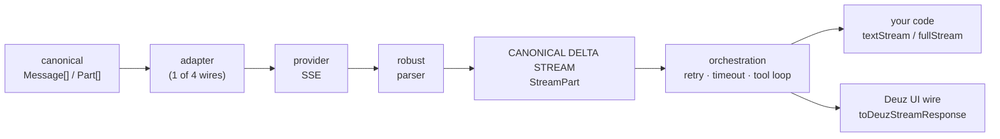

<div align="center">

<picture>
  <source media="(prefers-color-scheme: dark)" srcset="https://raw.githubusercontent.com/Deuz-AI/Deuz-SDK/main/assets/banner-dark.svg?v=1.6.1">
  
</picture>

<br>

[](https://www.npmjs.com/package/@deuz-sdk/core)
[](https://github.com/Deuz-AI/Deuz-SDK/blob/main/package.json)
[](https://github.com/Deuz-AI/Deuz-SDK/actions/workflows/ci.yml)
[](https://github.com/Deuz-AI/Deuz-SDK/blob/main/test/surface.test-d.ts)
[](./LICENSE)

**[Docs](./docs)** &nbsp;·&nbsp; **[Benchmarks](#the-cost-of-the-box)** &nbsp;·&nbsp; **[Comparison](#how-it-compares)** &nbsp;·&nbsp; **[Architecture](#architecture--the-canonical-line)** &nbsp;·&nbsp; **[Changelog](./CHANGELOG.md)**

</div>

```ts
import { streamChat } from '@deuz-sdk/core';
import { createAnthropic } from '@deuz-sdk/core/anthropic';
// or: createOpenAI, createGoogle, createXai, createVertex — same call, same stream

const anthropic = createAnthropic({ apiKey: process.env.ANTHROPIC_API_KEY });

const res = streamChat({
  model: anthropic('claude-opus-4-8'),
  messages: [{ role: 'user', content: 'Hello!' }],
}); // returns synchronously, never throws — failures arrive as typed stream parts

for await (const chunk of res.textStream) process.stdout.write(chunk);
const usage = await res.usage; // tokens — and USD, if you plug in /pricing
```

`@deuz-sdk/core` is a from-scratch, independent AI SDK: chat, agentic tool loops, sub-agents, durable sessions, structured output, embeddings, memory, RAG, skills, MCP, image generation and local-first observability — **one package, zero runtime dependencies**. The core is pure by construction and _enforced by lint_: no `Date.now()`, no `Math.random()`, no `process.env`, no `console` anywhere in `src/` — everything stateful is injected through one `Dependencies` seam, so the same code runs unchanged on Node, Deno, Bun and edge runtimes, and every test is a deterministic replay.

## Install

```sh
npm install @deuz-sdk/core     # pnpm add / bun add work the same
```

That is the whole dependency tree.

> [!NOTE]
> Node ≥ 22 (or any edge runtime with `fetch`). Optional peers load only if you use them: `zod` (or any Standard Schema library) for typed objects, `@modelcontextprotocol/sdk` for MCP, `react` for hooks, `unpdf`/`mammoth`/`xlsx` for document parsing.

> [!TIP]
> Using Claude Code, Cursor or another coding agent? Install the [Deuz skill](./skills/deuz-sdk) — it teaches the agent the SDK's real call patterns, edge-safety rules and exports:
>
> ```sh
> npx skills add Deuz-AI/Deuz-SDK
> ```

## Why Deuz

- **Zero runtime dependencies** — `npm ls --all` prints one line; [`package.json`](./package.json) is the receipt.
- **2.4 MB installed, ~50 ms to import** — 5–47× less disk and 5–20× faster cold-start than the other TypeScript AI SDKs ([measured](#the-cost-of-the-box), reproducible).
- **Edge-safe by lint, not by promise** — banned ambient APIs are a CI failure, and a [browser-bundle gate](./tooling) proves no `node:` import leaks into core.
- **Durable agents over any backend** — checkpoint/resume through a two-method `SessionStore`; no vendor workflow runtime ([tour](#durable-agents)).
- **Observable locally** — a versioned event protocol for every run; no hosted service, nothing captured by default ([tour](#observable-runtime)).
- **One canonical stream** — adapters never proxy raw provider bytes, which is why abort, retry, sub-agent forwarding and typed UI events all compose ([architecture](#architecture--the-canonical-line)).

## The cost of the box

<picture>
  <source media="(prefers-color-scheme: dark)" srcset="https://raw.githubusercontent.com/Deuz-AI/Deuz-SDK/main/assets/benchmark-dark.png?v=1.5.0">
  
</picture>

**2.4 MB installed. 1 package. ~50 ms to import.** Every number comes from [`bench/results.json`](./bench/results.json), measured on the same machine with the same procedure — regenerate all of it with `python bench/measure.py && python bench/chart.py` ([methodology](./bench)).

> [!NOTE]
> These are _bare-package_ installs, which favors the frameworks — `ai` and `langchain` still need separate provider packages to reach the six provider families this package ships built in. And footprint is not a quality score: it measures what you pay before your first token. The [comparison table](#how-it-compares) covers what each framework can do.

## The tour

### Durable agents

An agentic loop that checkpoints at every step boundary into a `SessionStore` — two methods, `save` and `load`, over any storage you like. Kill the process mid-run, or let a gated tool call suspend the run for human approval, then resume where it stopped:

```ts
import { generateText } from '@deuz-sdk/core';
import { resumeFromCheckpoint, createApprovalSigner } from '@deuz-sdk/core/durable';

// Leg 1 — checkpoint after each step; a `needsApproval` tool suspends the run.
const { pendingApprovals } = await generateText({
  model: anthropic('claude-opus-4-8'),
  messages: [{ role: 'user', content: 'Draft and publish the release notes.' }],
  tools: { publish: { ...publishTool, needsApproval: true } },
  session: { store, runId: 'run-42' },
});

// Leg 2 — hours later, in a different process. Cumulative usage and step
// indices carry across legs; resuming without a verdict DENIES by default.
const done = await resumeFromCheckpoint(store, 'run-42', {
  model: anthropic('claude-opus-4-8'),
  tools: { publish: publishTool },
  approvalResponses: [approved], // HMAC-signed, bound to runId, with expiry
});
```

Approval verdicts can be signed with `createApprovalSigner({ secret })` (WebCrypto HMAC-SHA256) so a client can't forge its way past a gate. No workflow runtime, no `'use workflow'` directives, no infrastructure — a checkpoint is a serializable value in your own database.

### Sub-agents that stay supervised

`agentTool` wraps a nested agent loop as an ordinary tool. Two things are first-class: the child's **entire stream forwards live** into the parent's `fullStream` (tagged with `agentPath`), and the parent's approval gate is **inherited at every nesting depth** — a sub-agent's tool calls suspend and resume through the same checkpoint machinery:

```ts
import { agentTool, generateText } from '@deuz-sdk/core';

const { text } = await generateText({
  model: anthropic('claude-opus-4-8'),
  messages: [{ role: 'user', content: 'Research the latest release notes and summarize them.' }],
  maxSteps: 5,
  tools: {
    researcher: agentTool({
      name: 'researcher',
      description: 'Delegate research to a focused sub-agent.',
      model: anthropic('claude-haiku-5'),
      tools: { webSearch },
    }),
  },
});
```

The loop underneath is production-hardened: parallel tool execution, self-healing tool errors, runaway guards, immutable history (prompt-cache-safe), budget stops (`totalTokensExceed`, `costExceeds`, `durationExceeds`), per-step hooks (`prepareStep`, `activeTools`), and opt-in `compaction: 'auto'` when context fills up.

### Observable runtime

Every run emits a versioned event protocol — model calls, TTFT, retries (with reason and backoff), agent steps, tool timings, approvals, checkpoints, compaction, sub-agent trees, cost. No API key, no account, no data leaves your process, and **no prompt or tool content is recorded by default** (content capture is opt-in and always redacted):

```ts
import { generateText } from '@deuz-sdk/core';
import { createMemoryObserver, summarizeRun } from '@deuz-sdk/core/observe';

const observer = createMemoryObserver();

await generateText({ model, messages, tools, maxSteps: 5, deps: { observer } });

console.log(summarizeRun(observer.latestRun() ?? []));
// { status: 'completed', stepCount: 3, modelCallCount: 3, toolCallCount: 2,
//   retryCount: 1, usage: {…}, costUsd: 0.042, durationMs: 8210, … }
```

Persist runs locally as JSONL (one valid JSON line per event, binary-safe):

```ts
import { createJsonlObserver } from '@deuz-sdk/core/observe/node';

const observer = createJsonlObserver({ file: '.deuz/runs.jsonl' });
const res = await generateText({ model, messages, tools, deps: { observer } });
await res.observation?.settled; // drain async cost enrichment
await observer.close();
```

Observers can never break a run — a throwing, slow, or closed observer is isolated, and with no observer the hot path pays a single boolean branch. An injected `Dependencies.tracer` receives the full `invoke → step → execute_tool` span hierarchy driven by the same events (an OTel exporter plugs into that seam). Durable runs keep one `runId` across suspend/resume legs, so a paused approval and its resume correlate in the same timeline.

### Structured output

```ts
import { generateObject } from '@deuz-sdk/core';
import { z } from 'zod'; // any Standard Schema library — or a raw JSON Schema

const { object } = await generateObject({
  model: anthropic('claude-opus-4-8'),
  messages: [{ role: 'user', content: 'Capital of France as JSON.' }],
  schema: z.object({ city: z.string() }),
});
```

`streamObject` streams the same thing progressively; `generateObject` picks the `json`/`tool` strategy per model capability and self-repairs one failed parse.

### React, over our own wire

The server speaks a versioned UI protocol (`toDeuzStreamResponse`), the client consumes it (`useChat` / `useObject`) — typed events end to end, never a provider's raw bytes:

```ts
import { useChat } from '@deuz-sdk/core/react';

const { messages, sendMessage, pendingApprovals, addToolApprovalResponse } = useChat({
  api: '/api/chat',
  onToolCall: async (call) => runInBrowser(call), // client tools auto-round-trip
});
// Gated tools pause into pendingApprovals; verdicts resume the chat automatically.
```

**Also in the box** — each one edge-safe, seam-driven, and covered by the same test discipline:

- **Memory** — mem0-style extract→reconcile→recall pipeline over a vector store _or_ an Obsidian-style markdown vault ([docs](./docs/content/docs/modules/memory.mdx))
- **RAG** — magic-byte sniffing, token-aware chunkers, and hybrid dense+BM25 retrieval with RRF fusion ([docs](./docs/content/docs/modules/rag.mdx))
- **Skills** — `SKILL.md` parser + progressive disclosure, compatible with the open agent-skills format ([docs](./docs/content/docs/modules/skills.mdx))
- **MCP** — tools, resources, prompts, elicitation; HTTP/SSE edge-safe, stdio on Node ([docs](./docs/content/docs/modules/mcp.mdx))
- **Images** — synchronous generation, async Midjourney, and the Yunwu unified relay ([docs](./docs/content/docs/modules/image-generation.mdx))
- **Middleware & pricing** — `wrapModel` composition, PII redaction, prompt-injection guard, and token→USD cost metering ([docs](./docs/content/docs/modules/middleware.mdx))

## Philosophy

**No dependencies.** Every byte in the box is ours to test, version and secure — supply-chain audits read one `package.json` line.

**No ambient state.** Clock, randomness, fetch, logging, tracing, key storage: all injected through one `Dependencies` seam. That's why every test is a deterministic replay and the core runs on any runtime.

**No raw SSE passthrough.** Everything normalizes to one canonical delta stream first; provider quirks live in a registry, not in your code.

**No vendor runtime.** Durability is a serializable checkpoint in _your_ database; observability is an event stream in _your_ process. Nothing phones home.

**Nothing recorded by default.** Content capture is opt-in per field, always redacted, and regression-tested against planted secrets.

## How it compares

Verified against each project's official docs and the npm registry on **2026-07-08** (versions: `ai@7.0.17`, `@mastra/core@1.50.1`, `langchain@1.5.2`, `llamaindex@0.12.1`, `@openai/agents@0.13.0`). ✅ yes · 🟡 partial/with caveats · ❌ no.

|                                                          | Deuz 1.6                               | ai 7                                        | Mastra                                | LangChain                              | LlamaIndex.TS                     | OpenAI Agents             |
| -------------------------------------------------------- | -------------------------------------- | ------------------------------------------- | ------------------------------------- | -------------------------------------- | --------------------------------- | ------------------------- |
| Zero runtime dependencies                                 | ✅                                      | ❌                                           | ❌                                     | ❌                                      | ❌                                 | ❌                         |
| ESM + CJS dual build                                      | ✅                                      | ❌ ESM-only                                  | ✅                                     | ✅                                      | ✅                                 | ✅                         |
| Edge runtimes without Node-compat shims                   | ✅ lint-enforced Web APIs               | 🟡                                          | 🟡 `nodejs_compat`                    | 🟡                                     | 🟡                                | 🟡 limited                |
| Durable checkpoint/resume without a vendor runtime        | ✅ two-method store, any backend        | ❌ needs Vercel Workflow runtime             | 🟡 storage-adapter packages           | 🟡 checkpointer packages, off by default | 🟡 workflow-core only, BYO store  | ✅ serializable `RunState` |
| Human approval inside sub-agents                          | ✅ suspends at any depth                | ❌ documented unsupported                    | ✅                                     | ✅                                      | ❌ not on `multiAgent`             | ✅                         |
| Cryptographically signed approvals                        | ✅ stable HMAC                          | 🟡 experimental; not with durable agent      | ❌                                     | ❌                                      | ❌                                 | ❌                         |
| **All three at once: durable ∧ signed ∧ sub-agent approval** | ✅                                   | ❌                                           | ❌                                     | ❌                                      | ❌                                 | ❌                         |
| Memory + RAG + skills in the install                      | ✅ one package                          | 🟡 patterns / hosted                         | 🟡 separate packages + storage        | ❌ split across packages                | 🟡 RAG+memory; no skills           | 🟡 OpenAI-hosted-centric  |
| Multi-provider in the core package                        | ✅ 6 families                           | ❌ per-provider packages or hosted gateway   | ✅ router (AI SDK machinery underneath) | ❌ per-provider packages               | ❌ per-provider packages           | ❌ OpenAI-first            |
| Token→USD cost metering in the library                    | ✅                                      | ❌ pushed to hosted gateway                  | 🟡 observability package + OLAP store | ❌ LangSmith feature                    | ❌                                 | ❌                         |
| First-class prompt-caching control                        | ✅ top-level `promptCaching`            | 🟡 per-part `providerOptions`                | 🟡 passthrough                        | 🟡 passthrough                          | 🟡 Anthropic-only                  | 🟡 one retention knob     |
| Local-first observability (no hosted service, no extra deps) | ✅ event protocol + JSONL + tracer bridge | ❌ OTel/gateway-centric                  | 🟡 platform-centric                   | ❌ LangSmith-only                       | 🟡 workflow plugin                 | 🟡 own traces platform    |
| OpenTelemetry exporter                                    | 🟡 tracer seam + full span hierarchy; exporter planned | ✅ `@ai-sdk/otel`             | ✅ built-in                            | ❌ LangSmith-only                       | 🟡 workflow plugin                 | 🟡 own traces platform    |

**Where they beat us, today:** the AI SDK ships 24+ first-party providers plus stable speech/transcription, reranking, realtime, and a mature OTel integration; Mastra bundles a 600+-model router and a full observability platform; LlamaIndex.TS remains the deepest RAG toolbox; OpenAI Agents has the tightest hosted-OpenAI integration. Deuz's answer is narrower on purpose: six quirk-locked provider families, and every ambient concern behind an injectable seam — 1.6's observation events drive that seam locally, and an OTel exporter plugs into the same protocol next.

> **What about Hermes?** Nous Research's [`hermes-agent`](https://github.com/NousResearch/hermes-agent) is a Python autonomous-agent _product_ (CLI, desktop, messaging gateways, a self-improving skill loop) — a different category, not an embeddable TypeScript library (the `hermes-agent` npm package is an unofficial launcher bridge). Deuz is the kind of SDK you'd use to build a Hermes-style agent in TypeScript — the two even share the open `SKILL.md` skills format.

<details>
<summary><b>Sources</b> — every cell above traces to an official doc or registry page</summary>

- **ai** — [ESM-only exports](https://registry.npmjs.org/ai/7.0.17) · [WorkflowAgent requires the Workflow runtime](https://ai-sdk.dev/docs/agents/workflow-agent) · [no approvals in subagents](https://ai-sdk.dev/docs/agents/subagents#no-tool-approvals-in-subagents) · [`experimental_toolApprovalSecret`, not on WorkflowAgent](https://ai-sdk.dev/docs/agents/tool-approvals#signing-approvals-with-experimental_toolapprovalsecret) · [no price table by design](https://github.com/vercel/ai/issues/3932) · [caching via providerOptions](https://ai-sdk.dev/providers/ai-sdk-providers/anthropic#cache-control) · [memory as patterns](https://ai-sdk.dev/docs/agents/memory) · [providers](https://ai-sdk.dev/docs/foundations/providers-and-models) · [telemetry](https://ai-sdk.dev/docs/ai-sdk-core/telemetry) · [speech](https://ai-sdk.dev/docs/ai-sdk-core/speech)
- **Mastra** — [dual build + Node deps](https://registry.npmjs.org/@mastra/core/latest) · [Workers via nodejs_compat](https://github.com/mastra-ai/mastra/blob/main/deployers/cloudflare/src/index.ts) · [snapshots need storage adapters](https://mastra.ai/docs/workflows/snapshots) · [tool approval](https://mastra.ai/docs/agents/agent-approval) · [networks + approval](https://mastra.ai/docs/agents/networks) · [memory packages](https://mastra.ai/docs/memory/overview) · [model router](https://mastra.ai/models) · [cost estimation in observability](https://mastra.ai/docs/observability/metrics/overview) · [OTel exporter](https://mastra.ai/docs/observability/integrations/exporters/otel)
- **LangChain** — [dual build](https://registry.npmjs.org/langchain/latest) · [persistence via checkpointers](https://docs.langchain.com/oss/javascript/langgraph/persistence) · [HITL middleware, unsigned](https://docs.langchain.com/oss/javascript/langchain/human-in-the-loop) · [subagents + interrupts](https://docs.langchain.com/oss/javascript/langchain/multi-agent/subagents) · [v1 package split](https://docs.langchain.com/oss/javascript/releases/langchain-v1) · [per-provider packages](https://docs.langchain.com/oss/javascript/langchain/install) · [cost = LangSmith](https://docs.langchain.com/langsmith/cost-tracking) · [caching passthrough](https://docs.langchain.com/oss/javascript/langchain/models#prompt-caching) · [observability = LangSmith](https://docs.langchain.com/oss/javascript/langchain/observability)
- **LlamaIndex.TS** — [dual build + edge conditions](https://registry.npmjs.org/llamaindex) · [serverless guide](https://developers.llamaindex.ai/typescript/framework/getting_started/installation/serverless) · [snapshot/resume + HITL in workflow-core](https://developers.llamaindex.ai/typescript/workflows/common_patterns/human_in_the_loop) · [multiAgent](https://developers.llamaindex.ai/typescript/framework/modules/agents/agent_workflow) · [memory](https://developers.llamaindex.ai/typescript/framework/modules/data/memory) · [no cost tables in source](https://github.com/run-llama/LlamaIndexTS) · [workflow OTel plugin](https://developers.llamaindex.ai/typescript/workflows/common_patterns/tracing)
- **OpenAI Agents** — [dual build](https://registry.npmjs.org/@openai/agents/latest) · [Workers = limited support](https://openai.github.io/openai-agents-js/guides/troubleshooting) · [RunState serialize/resume + nested approvals, unsigned](https://openai.github.io/openai-agents-js/guides/human-in-the-loop) · [sessions](https://openai.github.io/openai-agents-js/guides/sessions) · [models + AI SDK adapter](https://openai.github.io/openai-agents-js/guides/models) · [usage without pricing](https://openai.github.io/openai-agents-js/openai/agents-core/classes/usage/) · [tracing](https://openai.github.io/openai-agents-js/guides/tracing)
- **Hermes** — [repo (Python 82.5%)](https://github.com/NousResearch/hermes-agent) · [docs](https://hermes-agent.nousresearch.com/docs/) · [unofficial npm bridge](https://www.npmjs.com/package/hermes-agent)

</details>

## One package, 28 subpaths

Tree-shakable subpaths — no `@deuz-sdk/anthropic`, `@deuz-sdk/react`, … to version-match:

| Import                                                                       | What you get                                                                                                                   |
| ---------------------------------------------------------------------------- | ------------------------------------------------------------------------------------------------------------------------------ |
| `@deuz-sdk/core`                                                             | `streamChat` · `generateText` · `generateObject` · `streamObject` · `embed` · `agentTool` · `createClient` · types · errors      |
| `…/anthropic` · `…/openai` · `…/xai` · `…/google` · `…/vertex` · `…/voyage`  | Provider factories (Messages, Chat Completions + Responses, Gemini compat + native, Claude-on-Vertex, embeddings)                |
| `…/google/extras`                                                            | Gemini explicit caching + Files API                                                                                              |
| `…/durable`                                                                  | `resumeFromCheckpoint` · `resumeStreamFromCheckpoint` · `createApprovalSigner` · `createInMemorySessionStore`                    |
| `…/memory` · `…/memory/markdown`                                             | Memory pipeline + vector or markdown-vault stores                                                                                |
| `…/rag` · `…/rag/node`                                                       | Chunkers, retrieval, hybrid search + Node document parsers                                                                       |
| `…/skills` · `…/skills/node`                                                 | SKILL.md registry + filesystem source                                                                                            |
| `…/mcp` · `…/mcp/stdio`                                                      | MCP client (edge-safe HTTP/SSE; Node stdio)                                                                                      |
| `…/image` · `…/midjourney` · `…/yunwu`                                       | Image generation surfaces                                                                                                        |
| `…/ui` · `…/react`                                                           | Deuz UI wire (server + client) + React hooks                                                                                     |
| `…/observe` · `…/observe/node`                                               | Observation event protocol: memory/callback/composite observers + `summarizeRun` · JSONL persistence (Node)                      |
| `…/middleware` · `…/pricing` · `…/edge`                                      | Model wrappers · cost tables · guaranteed edge-safe subset                                                                       |

## Architecture — the canonical line



Adapters never proxy a provider's raw SSE to your code. Everything is normalized to one canonical delta stream first — that single decision is what makes abort, retry, multi-provider merging, sub-agent stream forwarding, and typed UI events possible. Reliability is layered on top: pre-first-byte retry with deterministic jitter, `Retry-After` honored, TTFT + total timeouts on an injected clock, and API keys masked in every log, error, and span path (regression-tested).

## Docs

The full documentation site lives in [`docs/`](./docs) — 40+ pages covering every module, with [`llms.txt`](./docs) for AI agents. A [Claude Code skill](./skills/deuz-sdk) teaches coding agents to integrate the SDK correctly, [`CHANGELOG.md`](./CHANGELOG.md) holds release history, and [`1.6.0.md`](./1.6.0.md) is the current release's code-verified design spec.

## Contributing

```sh
git clone https://github.com/Deuz-AI/Deuz-SDK.git && cd Deuz-SDK
npm install
npm run check   # format + lint (edge-safety) + typecheck + 575 tests + types lock + build + publint + attw + runtime/size/api gates
```

---

<div align="center">

Built by **Umutcan Edizaslan** — [X @UEdizaslan](https://x.com/UEdizaslan) · [GitHub @U-C4N](https://github.com/U-C4N)

<sub>With help from <b>Claude Opus 4.8</b> and <b>Claude Fable 5</b>.</sub>

<sub>[MIT](./LICENSE) © 2026</sub>

</div>
