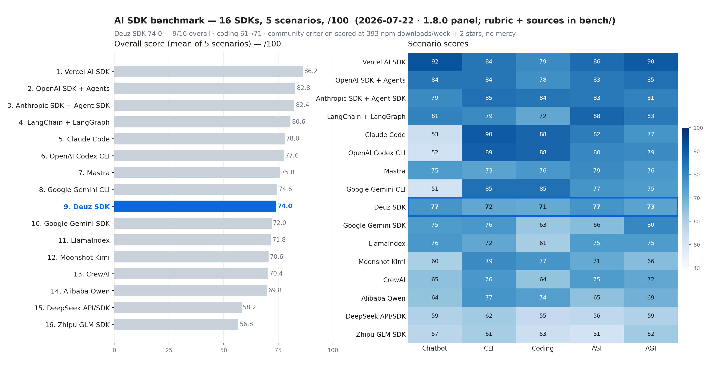
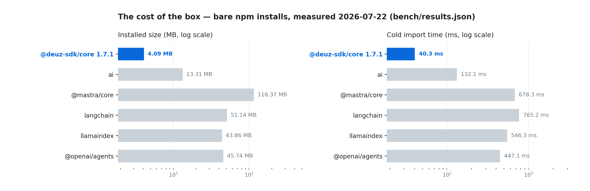

<div align="center">

# Deuz SDK

### Open-source TypeScript runtime for AI agents

[](https://www.npmjs.com/package/@deuz-sdk/core)
[](./packages/core/package.json)
[](./LICENSE)

**[Docs](./docs)** · **[Autonomy](./docs/content/docs/modules/autonomy.mdx)** · **[Changelog](./packages/core/CHANGELOG.md)**

</div>

Models are getting better every month. The gap we care about is not another wrapper around `fetch` — it is whether an agent can remember, use tools safely, plan and check its own work, survive a crash, ask a human before something risky, and keep going when a tab or a process dies.

That is what `@deuz-sdk/core` is for: a small, from-scratch TypeScript runtime — **one package, zero runtime dependencies** — so you can build agents that run in production, not only in demos.

We are not claiming to build ASI. The longer arc we care about is systems that can stay useful as models get smarter. Deuz is meant to be **honest infrastructure on that road** — a vehicle, not the destination.

## What ships today

Providers normalize to one canonical stream. Failures are typed parts on that stream, not thrown surprises. Clock, randomness, fetch, keys, and logging are injected, so the same code runs on Node, Deno, Bun, and the edge, and tests stay deterministic.

| Need | In the box |
| --- | --- |
| Memory across sessions | Recall + mem0-style extract/reconcile over a vector store or markdown vault — `memory: { seams, scope }` |
| Tool loops that hold up | Parallel tools, self-healing errors, runaway guards, budgets, sub-agents, MCP, skills, hybrid RAG |
| Plan → act → verify | `planTasks`, CodeAct sandboxes, `verifyStep`, workspace files, browser tools, background runs ([1.8](./docs/content/docs/modules/autonomy.mdx)) |
| Durable runs | Step checkpoints in *your* DB; `resumeFromCheckpoint` later — no workflow vendor |
| Human approval | `needsApproval` at any depth; HMAC-signed, expiring tokens; missing verdict = deny |
| Many models, one call shape | Anthropic, OpenAI, Azure, Bedrock, Gemini, xAI, Vertex, plus Mistral / DeepSeek / Qwen / Kimi / Groq / … via `./providers` and `createProviderRegistry` |
| Resumable UI | Refresh, network blip, and server crash look the same to the client |

Published on npm, covered by golden-replay tests, documented under [`docs/`](./docs).

## Quickstart

```ts
import { streamChat } from '@deuz-sdk/core';
import { createAnthropic } from '@deuz-sdk/core/anthropic';

const anthropic = createAnthropic({ apiKey: process.env.ANTHROPIC_API_KEY });

// Returns synchronously. Never throws. Failures arrive as typed stream parts.
const res = streamChat({
  model: anthropic('claude-opus-4-8'),
  messages: [{ role: 'user', content: 'Hello!' }],
});

for await (const chunk of res.textStream) process.stdout.write(chunk);
const usage = await res.usage;
```

Design rule: normalize provider bytes to a canonical delta stream *first*. Retry, failover, resume, budgets, and sub-agents can share one language.

## Install

```sh
npm install @deuz-sdk/core     # the runtime
npm install @deuz-sdk/react    # optional: useChat, useObject, headless UI
```

Node ≥ 22, or any edge runtime with `fetch`. Optional peers only when you use them: `zod` (or any Standard Schema library), `@modelcontextprotocol/sdk`, `react`, `unpdf` / `mammoth` / `xlsx`, `playwright`.

```sh
npx skills add Deuz-AI/Deuz-SDK   # optional skill for Claude Code / Cursor
```

## Autonomy (1.8)

Longer runs need more than chat: plan work, act (often by writing code), verify, persist progress. 1.8 adds those primitives as free functions on the same edge-safe core — heavy pieces stay behind Node seams you can swap (Docker, E2B, Playwright, …).

```ts
import { generateText } from '@deuz-sdk/core';
import { planTasks, nextPendingTask, setTaskStatus } from '@deuz-sdk/core/autonomy';
import { createWorkspaceTools } from '@deuz-sdk/core/workspace';
import { createFileWorkspace } from '@deuz-sdk/core/workspace/node';
import { codeActTool, shellTool } from '@deuz-sdk/core/compute';
import { createNodeSandbox } from '@deuz-sdk/core/compute/node';

const workspace = createFileWorkspace({ root: './.agent-workspace' });
const sandbox = createNodeSandbox({ allowedLanguages: ['python', 'bash', 'javascript'] });

let plan = await planTasks(goal, { model });

for (let task = nextPendingTask(plan); task; task = nextPendingTask(plan)) {
  const result = await generateText({
    model,
    messages: [{ role: 'user', content: task.title }],
    tools: {
      ...createWorkspaceTools(workspace),
      ...codeActTool(sandbox),
      ...shellTool(sandbox),
    },
    verifyStep: ({ text, attempt }) =>
      /\bdone\b/i.test(text)
        ? { ok: true }
        : { ok: false, feedback: 'Finish the task and confirm.', retry: attempt < 2 },
  });

  plan = setTaskStatus(
    plan,
    task.id,
    result.providerMetadata?.deuz?.verified === false ? 'failed' : 'done',
  );
}
```

`createNodeSandbox` is a reference host process — not production isolation. Cookbook: [Build your own Manus](./docs/content/docs/cookbooks/autonomous-agent.mdx).

## Where we actually are

Deuz is young: one maintainer, a small star count, a few hundred npm downloads a week (July 2026). On a self-scored panel of sixteen TypeScript AI SDKs — refreshed for the **1.8.0 autonomy surface** — we land **9th at 74.0 / 100** (was 14th / 69.6 on 1.7). Community weight is still harsh (393 downloads/week + 2 stars → criterion **23** in every scenario), and we did not curve the grade ([scores](./bench) · [research](./bench/research-1.8.0.md)).

The jump is almost all **coding** (61 → 71) and **ASI** (74 → 77): workspace tools, CodeAct sandboxes, `planTasks` → `verifyStep`, background runs, browser. Mastra’s remote sandboxes still beat our Node reference host on production isolation; Vercel still owns the ecosystem. Need the biggest ecosystem today? Use the Vercel AI SDK.

Our bet is smaller: a runtime you can hold in your head. Zero runtime deps. Lint-banned ambient clock/randomness in core. Durability without a workflow vendor. Autonomy without an Agent god-class. Observability without an account. Nothing phones home.

### The honest benchmark (1.8.0 panel)

Most SDK READMEs open with a benchmark they win. This one opens with the one we don't.

<picture>
  <source media="(prefers-color-scheme: dark)" srcset="./assets/benchmark-dark.png">
  
</picture>

<picture>
  <source media="(prefers-color-scheme: dark)" srcset="./assets/footprint-dark.png">
  
</picture>

Bare-package installs favor frameworks that split providers into separate packages. Footprint is not a quality score — it measures what you pay before the first token. Rubric, criterion breakdowns, and live community numbers: [`bench/`](./bench).

## Principles

- **Zero dependencies.** Ours to test, version, and secure.
- **No ambient state.** One `Dependencies` seam for clock, randomness, fetch, logging, keys.
- **One canonical stream.** Adapters never proxy raw provider bytes.
- **Your infrastructure.** Checkpoints and journals stay in your process and database.
- **Privacy by default.** Content capture opt-in, always redacted.
- **Honesty over hype.** The only leaderboard here ranks us 9th.

## The map

```
@deuz-sdk/core         streamChat · generateText · generateObject · streamObject · embed · agentTool
  providers            /anthropic  /openai  /azure  /bedrock  /google  /google/extras  /xai  /vertex  /voyage
                       /providers   (Mistral, DeepSeek, Qwen, Kimi, Groq, OpenRouter, … + createProviderRegistry)
  chat & wire          /chat  /chat/node  /ui  /durable
  memory & knowledge   /memory  /memory/markdown  /rag  /rag/node  /skills  /skills/node
  autonomy             /workspace  /workspace/node  /compute  /compute/node
                       /autonomy  /runtime  /runtime/node  /browser  /browser/node
  connect & media      /mcp  /mcp/stdio  /image  /midjourney  /yunwu
  ops                  /observe  /observe/node  /middleware  /pricing  /testing  /edge

@deuz-sdk/react        useChat · useObject · ToolApprovalCard · CostBadge
```

## Docs & contributing

[`docs/`](./docs) — start with [autonomy](./docs/content/docs/modules/autonomy.mdx), [durable runtime](./docs/content/docs/agents/durable-runtime.mdx), or [the unbreakable chatbot](./docs/content/docs/agents/unbreakable-chatbot.mdx).

```sh
git clone https://github.com/Deuz-AI/Deuz-SDK.git && cd Deuz-SDK
npm install
npm run check
```

---

<div align="center">

Built by **Umutcan Edizaslan** — [X @UEdizaslan](https://x.com/UEdizaslan) · [GitHub @U-C4N](https://github.com/U-C4N)

<sub>With help from <b>Claude Opus 4.8</b> and <b>Claude Fable 5</b>.</sub>

<sub>[MIT](./LICENSE) © 2026</sub>

</div>
